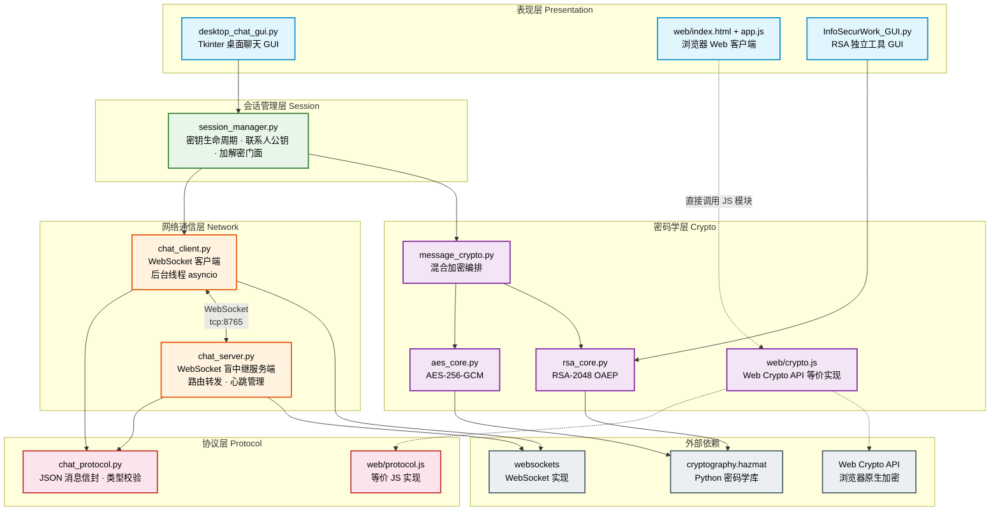
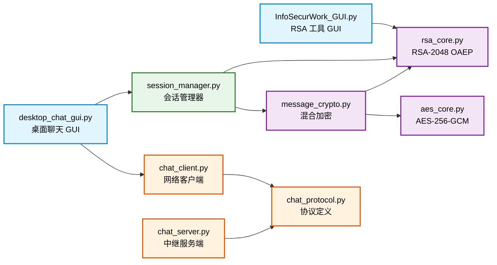
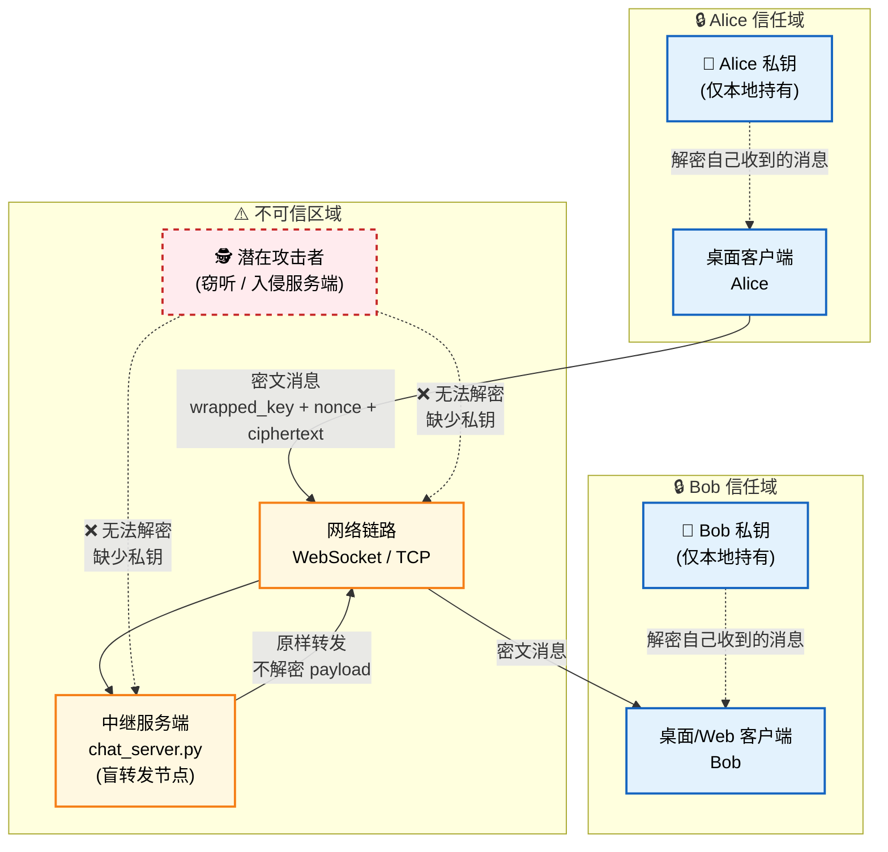
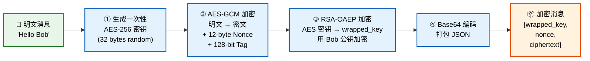
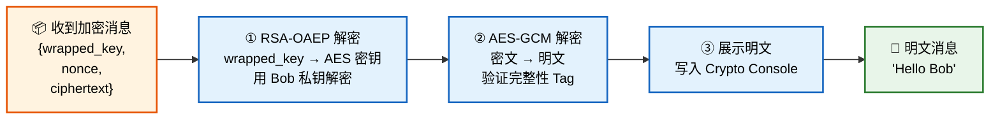
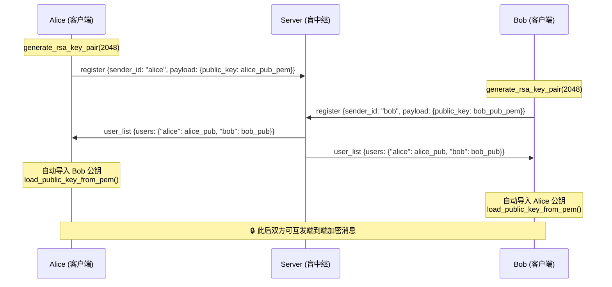
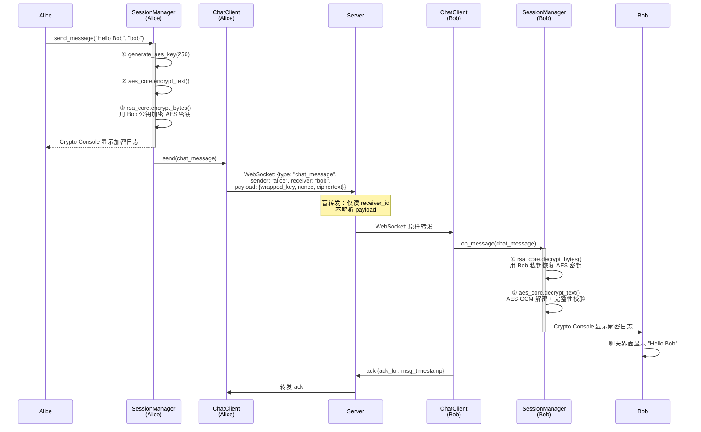
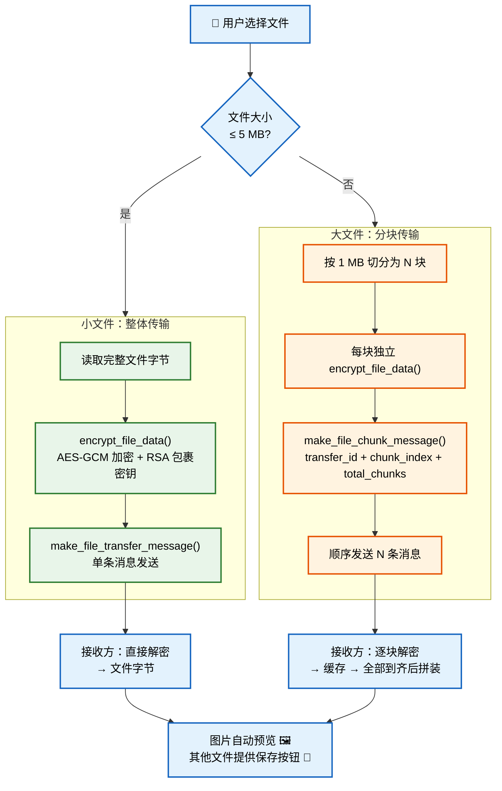
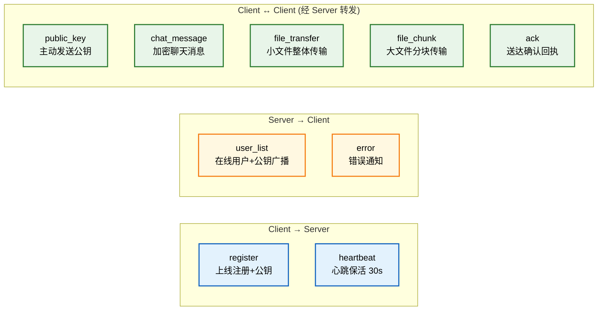
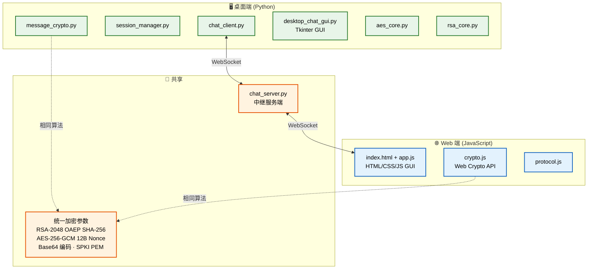

# 系统架构解读

> **项目**：端到端加密即时通讯软件  
> **技术栈**：Python 3.12 + websockets + cryptography | HTML/JS + Web Crypto API  
> **本文档**：面向 PPT 答辩，配套 Mermaid 架构图  
> **高清 PNG 图片**：`Demonstration/png/` 目录下，可直接插入 PPT

### PNG 文件索引

| 图编号 | 文件                              | 用途                      |
| ------ | --------------------------------- | ------------------------- |
| 图 1   | `png/01_layered_architecture.png` | 五层系统架构总览          |
| 图 2   | `png/02_module_dependency.png`    | 模块依赖关系              |
| 图 3   | `png/03_security_topology.png`    | 通信安全拓扑 + 信任边界   |
| 图 4   | `png/04_encrypt_flow.png`         | 消息加密流程（4 步）      |
| 图 5   | `png/05_decrypt_flow.png`         | 消息解密流程（3 步）      |
| 图 6   | `png/06_key_exchange.png`         | 密钥交换时序              |
| 图 7   | `png/07_message_sequence.png`     | 完整消息收发时序          |
| 图 8   | `png/08_file_transfer.png`        | 文件传输架构（分块/整体） |

---

## 一、总体分层架构

系统采用**五层架构**，自上而下为：表现层 → 会话管理层 → 网络通信层 → 协议层 → 密码学层。桌面端（Python/Tkinter）与 Web 端（HTML/JS）共享相同的协议与加密参数，通过同一中继服务端实现跨平台互通。



### 各层职责

| 层级           | 职责                                                | 核心文件                                                           |
| -------------- | --------------------------------------------------- | ------------------------------------------------------------------ |
| **表现层**     | 用户交互界面、事件处理、消息展示                    | `desktop_chat_gui.py`, `web/`, `InfoSecurWork_GUI.py`              |
| **会话管理层** | 本地密钥对管理、多联系人公钥映射、加解密统一入口    | `session_manager.py`                                               |
| **网络通信层** | WebSocket 连接管理、消息收发、心跳保活              | `chat_client.py`, `chat_server.py`                                 |
| **协议层**     | JSON 消息信封定义、字段校验、类型常量               | `chat_protocol.py`, `web/protocol.js`                              |
| **密码学层**   | AES-GCM 对称加密、RSA-OAEP 非对称加密、混合加密编排 | `message_crypto.py`, `aes_core.py`, `rsa_core.py`, `web/crypto.js` |

---

## 二、模块依赖关系图

展示所有 Python 模块之间的 import 依赖关系，箭头表示"依赖于"。



---

## 三、通信拓扑图

展示客户端、服务端之间的通信拓扑与安全边界。



### 盲转发设计要点

| 设计原则           | 实现方式                                                     |
| ------------------ | ------------------------------------------------------------ |
| **不持有私钥**     | 服务端代码无任何密码学 import                                |
| **不解密 payload** | `_handle_chat_message()` 原样 JSON 转发                      |
| **日志不泄露**     | 仅记录 `type, sender, receiver, payload_len`                 |
| **无持久化**       | 内存中仅维护 `{uid → ws}` 和 `{uid → pub_pem}`，不存聊天记录 |
| **路由依据**       | 仅读取 `msg["receiver_id"]` 决定转发目标                     |

---

## 四、消息加密数据流

### 4.1 发送方加密流程



### 4.2 接收方解密流程



### 4.3 密钥交换时序图



---

## 五、完整消息收发时序图



---

## 六、文件传输架构



---

## 七、协议消息类型总览



### 统一消息信封

```json
{
  "type": "chat_message",
  "sender_id": "alice",
  "receiver_id": "bob",
  "timestamp": "2026-04-20T12:00:00.000Z",
  "payload": {
    "wrapped_key": "Base64...",
    "nonce": "Base64...",
    "ciphertext": "Base64..."
  }
}
```

---

## 八、桌面端与 Web 端对照

两端使用**完全一致的加密参数**，通过同一中继服务端实现**跨平台互通**。



---

## 九、加密参数汇总

| 参数         | 值                   | 说明                             |
| ------------ | -------------------- | -------------------------------- |
| 对称算法     | AES-256-GCM          | AEAD 模式，同时加密 + 完整性校验 |
| 对称密钥长度 | 256 bit (32 bytes)   | 每条消息独立生成                 |
| Nonce 长度   | 12 bytes             | 随机生成，NIST 推荐长度          |
| Auth Tag     | 128 bit              | GCM 完整性标签                   |
| 非对称算法   | RSA-2048 OAEP        | SHA-256 + MGF1-SHA-256           |
| 公钥格式     | SPKI PEM             | 标准 X.509 公钥格式              |
| 公钥指纹     | SHA-256 前 16 hex    | 用于身份确认展示                 |
| 编码         | Base64 (标准)        | 所有密文/密钥/Nonce 统一编码     |
| 会话密钥     | 一次性 (per-message) | 前向隔离：单条泄露不影响其他     |
| 传输协议     | WebSocket (TCP:8765) | 全双工长连接                     |
| 心跳间隔     | 30 秒                | 客户端主动发送                   |
| 超时踢出     | 120 秒               | 服务端定期巡检                   |
| 大文件分块   | 1 MB / chunk         | 超过 5 MB 自动分块               |
